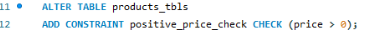
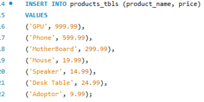
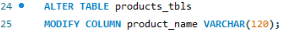
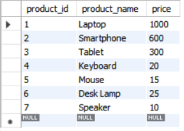

# Finals Lab Task 3 - Data Manipulation

# Create a product table with the following:
- id : unique integer, auto-inrcrement, primary key.
- product_name: STRING (VARCHAR) with a maximum length of 100, cannot be null.
- price : decimal
- Add a check constraint to ensure that the price of the product must be greater than 0.
- Insert Valid Products. In my case I add my own products but it is valid.
- Modify the product_name field to have a maximum of 120 characters.

# Insert The Following Product Records
- Laptop 999.99
- Headphones -49.99
- Smartphone 599.99
- Tablet 299.99
- Monitor -149.99
- Keyboard 19.99
- Mouse 14.99
- Desk Lamp 24.99
- External Hard Drive -79.99
- Speakers 9.99

# Queries
 1. Product Query

- Adding Constraint

 2. Insert Values

 3. Altering Table, Maximum of 120 Characters

# Table Structure

# RELATIONAL SCHEMA

